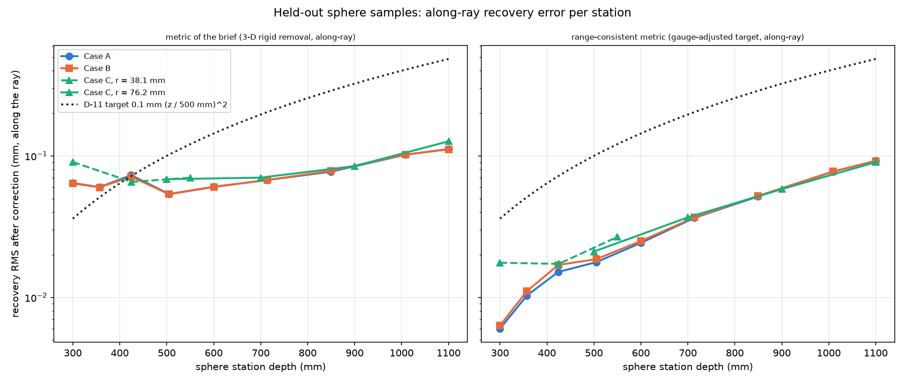
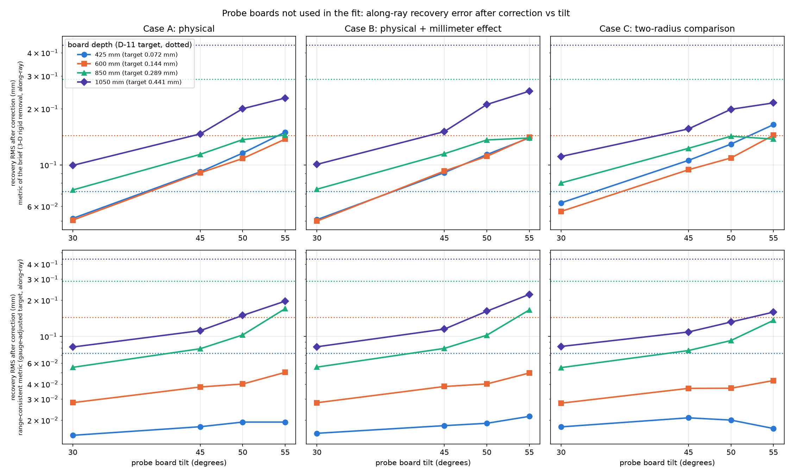

# One-sphere plan simulation, 2026-10-08

Script: `run_one_sphere_study.py` (run from the repository root, about 20 minutes for the three cases). Full results: `results.json`; one log per case `log_case_*.txt`; every table in full (including the other gauge variants and probe spheres by depth and incidence) in `summary_tables.md`. Large data (rendered `.mc` files) goes to the scratchpad folder and is deleted after each case.

## Setup

- Camera: the indicative 640 x 480 camera of `synthetic.py` (principal point 292.3, 256.8 px, so it is NOT centered). Effective block 4, noise k = 1.79e-7 /mm, exponent 1.3, no-read onset 55 deg. Frames per pose: 5 (a fit takes 4 to 5 minutes, so the 3-frame fallback was not needed). Synthetic rng seed 2026 in every case.
- Plan (`PlanParameters(fov_fill=0.7, board_half_size_mm=(100, 75), board_lateral_fill=0.2)`, otherwise defaults), converted with `DEFAULT_SENSOR_TO_POSITIONER`. Board orientation checked before running (preflight, one frame of every pose): a board with its normal flipped gives 0 hit pixels, every planned board delivers at least 93 percent and every sphere at least 65 percent of its expected image footprint (read pixels / geometric footprint; threshold was 20 percent).
- **Pose count deviates from the brief: 145 sphere + 47 board = 192, not 151 + 49 = 200.** The 151 + 49 of the procedure is what the same settings give for a camera with a centered principal point and a 49.9 x 38.5 deg field (checked: 151 + 49, stations 9, 9, 9, 9, 13, 15, 21, 31, 35). With the indicative camera's off-center principal point the planner gives stations 9, 9, 9, 9, 9, 13, 21, 31, 35 and drops 3 tilted boards at 350 mm instead of 1. I used the indicative camera as instructed.
- Cases: A physical (planar bowl and slope part without D * curvature, plus K_W kappa_m F, W = 8 px^2, K_W = 4 px^2); B = A + E c F, E = 2 mm^2; C = A's field with the old plan: 38.1 mm sphere at 300, 425, 550 mm (3 x 3 grids, 9 poses each at most) + 76.2 mm sphere at 500, 700, 900, 1100 mm + boards at 350, 550, 800, 1050 mm: **180 poses (143 sphere + 37 board)**.
- Fit: production defaults (`CorrectionFitParameters()`: default model configuration, pose_cv smoothing, holdout 0.2 / seed 12345 stratified by kind, sample stride and effective block 4). Held-out: 38 poses (29 sphere + 9 board) in A and B, 36 (29 + 7) in C.
- Truth: pixel rays intersected with the TRUE sphere or plane at the TRUE pose (true transform), never the injected field.
- Probes (separate dataset, rng seed 2027, 5 frames, same fitted map and transform): 32 probe boards (tilts 30/45/50/55 deg, azimuths 0/90, depths 425/600/850/1050 mm, centered; the planner's corner test dropped none) and 20 probe spheres (r = 76.2 mm at 330/465/650/950 mm, centered and at plus/minus 60 percent of the planner's room along both axes, 5 positions).

## Two recovery metrics (read this before the tables)

1. **Metric of the brief ("recovery")**, as in `tests/test_end_to_end.py`: corrected points carried into the true sensor frame with the fitted transform, true points = ray intersected with the true target, best rigid motion removed with `rigid_component_of_displacements` (3-D, weighted), along-ray component, weighted RMS. The gauge is estimated on the held-out samples and applied to the probes unchanged ("heldout" variant; two other variants are in `summary_tables.md`).
2. **Range-consistent metric** (added by me, in the study script only). While checking the first run I found that the brief's metric has a floor: the fitted transform differs from the true one by a rigid motion G (0.24 mm, 0.013 deg in A), so the carried corrected point of a pixel and the true point of the same pixel lie at different places on the target (the carried point has slid along the target by about |G|), and that slide is not a rigid motion of the point set, so removing the best rigid motion does not remove it. I measured the floor by evaluating the same metric for a perfect map (corrected range = range to the target as the fit believes it): it is the number in brackets "floor" below, and it is almost the whole recovery value for spheres (A held-out spheres 0.0637 against floor 0.0626) and grows with incidence. The range-consistent metric avoids the slide: the believed target is the true target moved by a rigid motion G' (6 parameters, Gauss-Newton, started at the fit's own G), the error is (measured + map) - (range along the pixel ray to the moved target), and G' minimizes the weighted sum of squares on the held-out samples. With G' equal to the fit's gauge this is the fit's own residual. Truth enters only through the true target poses.

"Noise floor" is the RMS of frame noise implied by the sample weights (pooled temporal variance of the mean of 5 frames); an RMS close to it means the remaining error is mostly noise, not systematic.

## Plan and fit

| Case | poses (sphere + board) | held-out poses | held-out samples | held-out residual RMS before / after (mm) | alternation rounds | fitted vs true transform | effective dof | smoothing multipliers (position / slope / curvature) |
|---|---|---|---|---|---|---|---|---|
| A | 192 (145 + 47) | 38 (29 + 9) | 51961 | 0.0949 / 0.0128 | 7 | 0.243 mm, 0.0135 deg | 280 | 1e4 / 1e4 / 10 |
| B | 192 (145 + 47) | 38 (29 + 9) | 51960 | 0.1060 / 0.0133 | 7 | 0.247 mm, 0.0129 deg | 280 | 1e4 / 1e4 / 10 |
| C | 180 (143 + 37) | 36 (29 + 7) | 25581 | 0.1333 / 0.0188 | 8 | 0.288 mm, 0.0174 deg | 454 | 1e2 / 1e4 / 1 |

## Held-out recovery RMS (mm), after (before) correction

Range-consistent metric, then the brief's metric with the perfect-map floor in brackets. Held-out noise floor: A 0.0125, B 0.0125, C 0.0146 (all samples). The held-out boards of A and B have no samples above 40 deg incidence (their tilts are at most 40 deg), hence the n/a.

| group | A: range-consistent | B: range-consistent | C: range-consistent | A: brief metric [floor] | B: brief metric [floor] | C: brief metric [floor] |
|---|---|---|---|---|---|---|
| all | 0.013 (0.091) | 0.013 (0.104) | 0.018 (0.125) | 0.055 (0.109) [0.053] | 0.055 (0.121) [0.053] | 0.057 (0.131) [0.051] |
| sphere | 0.011 (0.101) | 0.012 (0.111) | 0.022 (0.161) | 0.064 (0.124) [0.063] | 0.063 (0.134) [0.062] | 0.080 (0.175) [0.072] |
| board | 0.015 (0.067) | 0.015 (0.087) | 0.014 (0.082) | 0.030 (0.068) [0.025] | 0.030 (0.087) [0.025] | 0.026 (0.076) [0.018] |
| sphere 0-20 deg | 0.009 (0.069) | 0.010 (0.067) | 0.019 (0.067) | 0.033 (0.074) [0.032] | 0.032 (0.071) [0.031] | 0.043 (0.073) [0.038] |
| sphere 20-40 deg | 0.011 (0.066) | 0.011 (0.072) | 0.021 (0.122) | 0.057 (0.087) [0.056] | 0.057 (0.092) [0.056] | 0.074 (0.136) [0.067] |
| sphere 40-55 deg | 0.014 (0.164) | 0.014 (0.184) | 0.028 (0.282) | 0.090 (0.200) [0.089] | 0.090 (0.221) [0.089] | 0.118 (0.305) [0.109] |
| board 0-20 deg | 0.014 (0.070) | 0.015 (0.092) | 0.012 (0.083) | 0.030 (0.072) [0.025] | 0.030 (0.092) [0.024] | 0.024 (0.078) [0.017] |
| board 20-40 deg | 0.019 (0.042) | 0.019 (0.056) | 0.031 (0.062) | 0.032 (0.036) [0.026] | 0.032 (0.047) [0.027] | 0.042 (0.043) [0.028] |
| board 40-55 deg | n/a | n/a | 0.064 (0.077) | n/a | n/a | 0.140 (0.136) [0.117] |

Sphere recovery per station (range-consistent, after; stations with 1 to 6 held-out poses; `fig_sphere_recovery.png`), A / B, with the D-11 target: 300 mm 0.0060 / 0.0063 (0.036); 357: 0.0103 / 0.0110 (0.051); 424: 0.0151 / 0.0169 (0.072); 505: 0.0177 / 0.0186 (0.102); 600: 0.0243 / 0.0250 (0.144); 714: 0.0364 / 0.0367 (0.204); 849: 0.0516 / 0.0520 (0.288); 1009: 0.0773 / 0.0777 (0.407); 1100: 0.0923 / 0.0919 (0.484). Case C (range-consistent): 38.1 mm sphere 0.0176, 0.0172, 0.0268 at 300, 425, 550 mm; 76.2 mm sphere 0.0211, 0.0368, 0.0582, 0.0903 at 500, 700, 900, 1100 mm. Brief metric per station is in `summary_tables.md` (A: 0.064 at 300 mm rising to 0.112 at 1100 mm, floor 0.063 to 0.058).

## Probe boards (not used in the fit), recovery RMS after (before) correction, mm

Gauge estimated on the held-out samples. Range-consistent metric, then the brief's metric with floor in brackets. D-11 target = 0.1 mm (z / 500 mm)^2. The last column is the number of usable samples (case A); at 55 deg only the half of the board below the 55 deg cut-off is usable, so those cells rest on few samples (10 and 12 samples at 1050 and 850 mm, 106 at 600 mm, 629 at 425 mm). Per-azimuth rows are in `results.json`.

| tilt | depth | D-11 target | noise floor | A: range-consistent | B: range-consistent | C: range-consistent | A: brief metric [floor] | B: brief metric [floor] | C: brief metric [floor] | samples (A) |
|---|---|---|---|---|---|---|---|---|---|---|
| 30 | 425 | 0.072 | 0.013 | 0.015 (0.022) | 0.016 (0.021) | 0.018 (0.020) | 0.052 (0.067) [0.050] | 0.051 (0.053) [0.050] | 0.063 (0.058) [0.054] | 6692 |
| 30 | 600 | 0.144 | 0.025 | 0.028 (0.037) | 0.028 (0.032) | 0.028 (0.036) | 0.051 (0.072) [0.044] | 0.050 (0.059) [0.044] | 0.056 (0.064) [0.048] | 3393 |
| 30 | 850 | 0.289 | 0.051 | 0.055 (0.064) | 0.055 (0.061) | 0.055 (0.067) | 0.073 (0.085) [0.047] | 0.074 (0.075) [0.048] | 0.080 (0.079) [0.057] | 1689 |
| 30 | 1050 | 0.441 | 0.079 | 0.082 (0.093) | 0.082 (0.091) | 0.082 (0.095) | 0.099 (0.107) [0.057] | 0.101 (0.098) [0.057] | 0.111 (0.101) [0.072] | 1064 |
| 45 | 425 | 0.072 | 0.015 | 0.018 (0.190) | 0.018 (0.172) | 0.021 (0.175) | 0.092 (0.265) [0.087] | 0.091 (0.242) [0.086] | 0.106 (0.251) [0.095] | 4517 |
| 45 | 600 | 0.144 | 0.031 | 0.038 (0.223) | 0.038 (0.213) | 0.037 (0.176) | 0.091 (0.285) [0.077] | 0.093 (0.263) [0.077] | 0.094 (0.272) [0.084] | 2301 |
| 45 | 850 | 0.289 | 0.065 | 0.079 (0.252) | 0.079 (0.255) | 0.076 (0.167) | 0.114 (0.294) [0.079] | 0.115 (0.272) [0.080] | 0.123 (0.281) [0.093] | 1215 |
| 45 | 1050 | 0.441 | 0.101 | 0.112 (0.288) | 0.115 (0.299) | 0.109 (0.180) | 0.147 (0.317) [0.092] | 0.151 (0.297) [0.093] | 0.156 (0.305) [0.115] | 758 |
| 50 | 425 | 0.072 | 0.015 | 0.019 (0.279) | 0.019 (0.261) | 0.020 (0.271) | 0.116 (0.373) [0.106] | 0.114 (0.350) [0.104] | 0.129 (0.359) [0.116] | 2481 |
| 50 | 600 | 0.144 | 0.032 | 0.040 (0.317) | 0.040 (0.308) | 0.037 (0.275) | 0.108 (0.399) [0.093] | 0.111 (0.376) [0.093] | 0.109 (0.385) [0.100] | 1120 |
| 50 | 850 | 0.289 | 0.067 | 0.103 (0.357) | 0.102 (0.362) | 0.092 (0.266) | 0.137 (0.416) [0.088] | 0.136 (0.394) [0.090] | 0.143 (0.403) [0.101] | 571 |
| 50 | 1050 | 0.441 | 0.105 | 0.150 (0.389) | 0.162 (0.405) | 0.132 (0.264) | 0.200 (0.426) [0.105] | 0.211 (0.405) [0.106] | 0.199 (0.414) [0.130] | 296 |
| 55 | 425 | 0.072 | 0.014 | 0.019 (0.383) | 0.022 (0.364) | 0.017 (0.389) | 0.150 (0.517) [0.137] | 0.140 (0.494) [0.133] | 0.165 (0.503) [0.152] | 629 |
| 55 | 600 | 0.144 | 0.030 | 0.050 (0.439) | 0.050 (0.430) | 0.043 (0.408) | 0.138 (0.556) [0.117] | 0.141 (0.533) [0.116] | 0.144 (0.543) [0.127] | 106 |
| 55 | 850 | 0.289 | 0.080 | 0.170 (0.506) | 0.166 (0.515) | 0.136 (0.425) | 0.145 (0.626) [0.091] | 0.140 (0.603) [0.095] | 0.138 (0.612) [0.096] | 12 |
| 55 | 1050 | 0.441 | 0.139 | 0.197 (0.545) | 0.224 (0.561) | 0.159 (0.427) | 0.229 (0.637) [0.092] | 0.249 (0.615) [0.096] | 0.215 (0.624) [0.106] | 10 |

Pooled over depths, range-consistent, after (before): A tilt 30/45/50/55 deg: 0.019 (0.026), 0.023 (0.195), 0.025 (0.284), 0.022 (0.385); C: 0.021, 0.025, 0.025, 0.019. Pooled by true incidence 40-55 deg (all probe boards): A 0.0256 (0.267), B 0.0258, C 0.0258; brief metric A 0.107 (0.351) with floor 0.098.

## Probe spheres (r = 76.2 mm between the ladder stations), recovery RMS after (before), mm

| group | D-11 target | A range-consistent | B | C | A brief metric [floor] |
|---|---|---|---|---|---|
| overall | | 0.0121 (0.0978) | 0.0127 (0.1081) | 0.0181 (0.0945) | 0.0615 (0.1171) [0.0605] |
| 330 mm | 0.044 | 0.0086 (0.0856) | 0.0091 | 0.0175 | 0.0627 [0.0626] |
| 465 mm | 0.086 | 0.0155 (0.1081) | 0.0164 | 0.0168 | 0.0580 [0.0551] |
| 650 mm | 0.169 | 0.0286 (0.1859) | 0.0293 | 0.0303 | 0.0592 [0.0528] |
| 950 mm | 0.361 | 0.0657 (0.4049) | 0.0664 | 0.0643 | 0.0893 [0.0589] |
| incidence 0-20 | | 0.0094 | 0.0096 | 0.0175 | 0.0321 [0.0297] |
| incidence 20-40 | | 0.0112 | 0.0116 | 0.0182 | 0.0554 [0.0543] |
| incidence 40-55 | | 0.0160 (0.1694) | 0.0169 | 0.0184 | 0.0894 [0.0888] |

## Wall times (seconds)

| Case | render fit data | fit | held-out metrics | probes (render + samples + metrics) | total |
|---|---|---|---|---|---|
| A | 92 | 260 | 1 | 33 | 386 |
| B | 93 | 263 | 1 | 33 | 391 |
| C | 83 | 231 | 1 | 31 | 346 |

(4 cores; the three cases plus preflight take about 20 minutes.)

## Things that looked wrong or need attention

- **Pose count 192, not 200** (above): indicative camera has an off-center principal point.
- **The brief's metric is dominated by a floor** when the fitted transform differs from the true one by a few tenths of a millimeter: perfect-map floor 0.053 of 0.055 overall in A, 0.089 of 0.090 for spheres at 40-55 deg. With it, the probe boards at 425 mm exceed the D-11 target for tilts 45, 50, 55 deg in all three cases (0.092, 0.116, 0.150 in A against 0.072) and "after" is worse than "before" in four cells (B 30 deg/1050 mm: 0.1007 vs 0.0980; C 30 deg at 425, 850, 1050 mm: 0.0626 vs 0.0580, 0.0801 vs 0.0785, 0.1111 vs 0.1012), differences of 0.001 to 0.010 mm, below the noise floor of those cells (0.013 to 0.079 mm). The 425 mm cells are the ones where the floor (0.087 to 0.137) explains most of the excess over the target; C also exceeds the target at 55 deg/600 mm (0.1443 against 0.1440, 106 samples). With the range-consistent metric no probe-board cell (held-out gauge) exceeds the target and none is worse after than before. Which metric is the right one for the design question is for the reviewer; I report both.
- **Gauge variants.** With one gauge fitted on all probe boards together ("pooled_probes") the range-consistent errors of the far, steep probes get WORSE than before correction in some cells (A 55 deg/850 mm: 0.164 vs 0.072; 55 deg/1050 mm: 0.184 vs 0.111; 50 deg/850 and 1050 mm: 0.095 vs 0.081, 0.137 vs 0.119; B and C similar), because that gauge is dominated by the many low-noise near samples. With a separate gauge per probe, a few cells are marginally worse after than before (e.g. A 55 deg/850 mm 0.057 vs 0.053). These variants are in `summary_tables.md`; the primary one (held-out gauge) shows none.
- **Noise.** Far probe boards are noise-limited: range-consistent RMS at 1050 mm is 0.082 (30 deg) against a noise floor of 0.079; at 425 mm 0.015 against 0.013. The excess over noise in quadrature for A (held-out gauge) is 0.01 to 0.02 mm at 30 deg and 0.04 to 0.15 mm at 50-55 deg for 850 and 1050 mm (those cells have 2 to 12 samples per probe at 55 deg).
- **Smoothing at the grid edge.** pose_cv chose the largest multiplier of the production grid (1e4) for the position and slope terms in A, B (and slope in C), i.e. it wanted even more smoothing than the grid offers. Not changed (production settings). Effective degrees of freedom 280 (A, B) and 454 (C).
- **Case B is indistinguishable from A** in every metric (held-out group differences 0.0003 to 0.0006 mm; probe-board cells up to 0.003 mm, except the few-sample 55 deg cells at 850 and 1050 mm, up to 0.03 mm): the fixed-footprint term E c F is at most 0.026 mm x F (about 0.09 mm at 55 deg) on spheres only, and the map absorbs it or it stays below the noise.
- **Held-out boards** (9 poses in A and B) are all at tilt 40 deg or less, so held-out board incidence 40-55 deg is empty in A and B; the probe boards are the only test there. No sample has a TRUE incidence above 55 deg (that bin is empty everywhere).
- **Injected planar part is a smooth function of the map inputs** (bowl, slope^2), which the map can represent exactly; this is the same planar part as in every earlier simulation, so these probes test generalization to unseen tilts, not to a field the map cannot represent.
- Probe spheres use the same sphere as the fit, at depths between stations; the held-out sphere errors of A at 300 mm (0.006 mm) lies below the noise floor (0.010 mm), which is possible only because the noise floor is an estimate from pooled variances.
- No library behavior or file was changed. The study script imports the private `_error_field` from `sphcal/simulate/synthetic.py` (with zero curvature to drop the D term).

## End-to-end test edit

`tests/test_end_to_end.py`: one sphere radius (76.2 mm) instead of 40 / 80 mm and depth range 300 to 1100 mm; the scaled camera has the same field of view as the full one, so 76.2 mm has the same apparent size (a radius scaled by 4, 304.8 mm, would put the camera inside the sphere at 300 mm). `test_sample_curvature_input_...` now checks the single curvature 1/76.2. No tolerance changed. All 5 tests in the file pass; full suite 161 passed, 2 skipped. For the record, the test's recovery RMS is now 0.032 mm (limit 0.08) and the held-out ratio after/before 0.25 (limit 0.5); the largest curvature input in the training samples is 0.466 mm/px^2 against the model bound 0.5 (close, because the scaled camera has 4 times smaller pixels).
