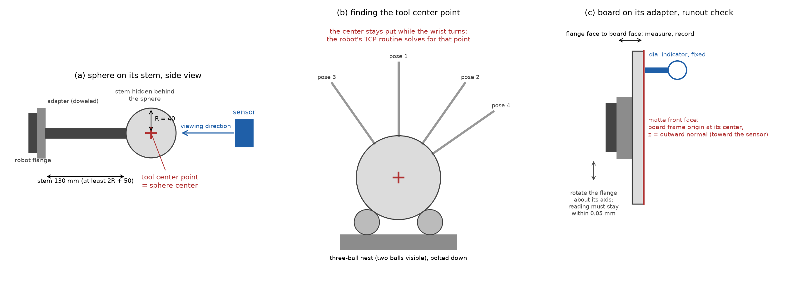
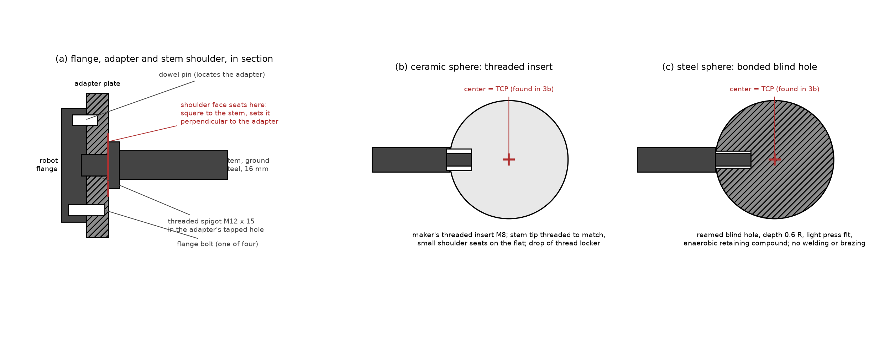
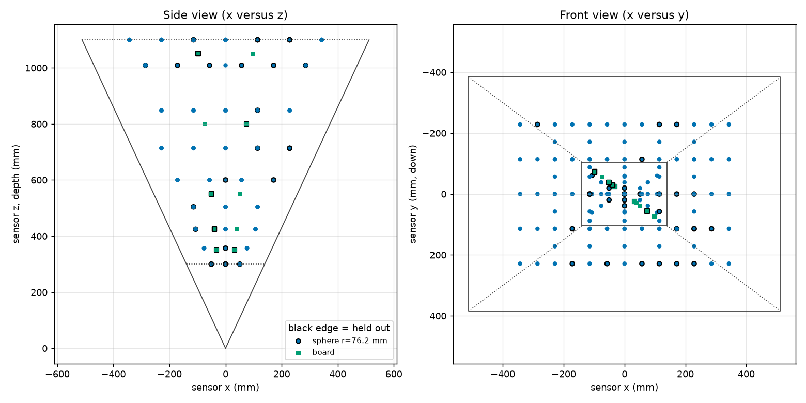

# Stage-1 calibration captures: step-by-step procedure

Audience: the robot technician who will set up the fixtures, program the
robot, and record the captures. No knowledge of the calibration math is
needed. Where a step says "run", a computer with Python and this repository
is needed (appendix C says how to set it up); the engineer can run those steps for you if you send the files.

What you are producing: a folder of sensor capture files (`.mc`), one group of
files per robot pose, plus a small table (the manifest) that says, for every
file, which target was in view and exactly where the robot had put it. The
calibration software uses that table to work out the sensor's errors. If the
table is wrong, the calibration is wrong, so most of this procedure is about
getting the table right.

Figure 1 (`figures/fig_fixtures.png`) shows the three fixtures; figure 2 (section 6) shows an example pose plan; figure 3 (section 3a) shows the sphere mounting in section.



---

## 1. Equipment

| Item | Requirement | Notes |
|---|---|---|
| Sensor | The depth sensor to be calibrated, rigidly mounted; it must not move during the whole session | Mount on a stiff bracket, not a tripod; mark its position so a bump is noticed |
| Robot | Six-axis industrial robot, absolute positioning accuracy 0.1 mm or better over the working volume, with a 50 mm or larger ISO flange | A robot that has been calibrated by its maker ("absolute accuracy" option) is needed; repeatability alone is not enough |
| Sphere A | Precision sphere, 3 inch (76.2 mm) diameter, matte, with a threaded hole or a bonded stem | Ceramic (zirconia or alumina) with a matte finish, or a steel sphere bead-blasted and matte-painted; certificate stating the diameter to 0.01 mm |
| Sphere B | Precision sphere, 6 inch (152.4 mm) diameter, matte, same construction | Same supplier if possible so the finish matches |
| Stems | One stem per sphere, ground steel, 16 mm diameter for sphere A and 30 mm for sphere B, length at least 2R + 50 mm from the adapter face to the sphere surface (130 mm for A, 205 mm for B), turned shoulder at the adapter end, matte black | Section 3a gives the design; a slender stem sags and moves the sphere center |
| Adapter plates | One per sphere; bolts to the robot flange on its dowel pin, central tapped hole (M12 for A, M20 for B) machined square to the mounting face | Section 3a; use the dowel every time, so the adapter goes back in the same place |
| Board | Flat plate 200 mm x 150 mm, at least 6 mm thick, front face matte and light gray, flat to 0.05 mm after finishing | Ground aluminum tooling plate or float glass, matte-painted; ask the supplier for a flatness report. Thickness is not a stiffness matter (a 6 mm plate sags about 0.002 mm under its own weight); it only has to survive the finish and the mounting flat. Do not bead-blast a plate thinner than about 10 mm: peening one face bows it. Paint over the ground or glass surface instead, and check the flatness after painting and mounting, not before |
| Board adapter | Plate that bolts to the flange with the dowel pins and holds the board with its front face perpendicular to the flange axis and its center on the flange axis | Three-point mounting (two dowels and a clamp) so the board goes back in the same place |
| Three-ball nest | Three hardened balls, about 24 mm diameter, pressed into a base, bolted to the table within reach of the robot | Used once per sphere to find the tool center point (section 3b) |
| Dial indicator with magnetic base | 0.01 mm resolution | Board runout check |
| Capture computer | Runs the sensor's capture software, writes `.mc` files with the sensor's own name in the file name | Must have at least 10 GB free per 1,000 frames |

Appendix A lists suppliers for the spheres and the board; appendix B says where the software named in sections 5 to 8 is and how to install it.

Optional: a certified two-sphere bar (two matte spheres on a rigid bar, center-to-center distance known to 0.02 mm). It gives an independent check of the result (section 9).

## 2. Before anything else

1. Switch the sensor on and leave it running for at least 30 minutes before the first capture, and leave it running for the whole session. Note the time it was switched on.
2. Fix the sensor's exposure and gain to the values that will be used in production. Write them down. Do not use automatic exposure.
3. Switch off or block any sunlight or lamps that fall on the targets. Room light is fine if it is constant.
4. Confirm with the engineer what the robot base frame is (which frame the robot's position readout is in). Every pose in this procedure is recorded in that frame. Do not change the active base frame during the session.
5. Record in a text file (`session_notes.txt`): date, sensor serial number, exposure and gain, robot model and controller software version, the active base frame name, the sphere and board certificates (diameter, flatness), room temperature, and anything unusual.

## 3. Mounting the spheres and finding their tool center points

### 3a. Suggested mounting: flange, adapter, stem, sphere

Figure 1a shows the arrangement and figure 3 the joint details. The goal is a
stiff, repeatable chain from the robot flange to the sphere center; where the
center ends up does not need to be known from drawings, because the tool
center point routine (3b) measures it, but it must not move afterwards.



Figure 3. Section through the sphere mounting: adapter plate on the flange's dowel and bolts, stem with a turned shoulder seated on the adapter face, and the sphere end either threaded into the sphere's insert (ceramic spheres) or bonded into a reamed blind hole (steel spheres).

1. Adapter plate. One plate per sphere, steel or aluminum, 12 mm thick, drilled to the robot's flange pattern (for a 50 mm ISO 9409-1 flange: four M6 on a 50 mm circle and one 6 mm dowel) with a central tapped hole for the stem: M12 for sphere A, M20 for sphere B. Have the plate's mounting face, its outer face and the tapped hole machined in one lathe setup, located on the flange pilot diameter, so the hole is perpendicular to the mounting face within 0.02 mm over 100 mm. Always mount it on the dowel; the dowel is what makes a remount land in the same place.
2. Stem. Ground steel rod (drill rod or silver steel): 16 mm diameter for sphere A, 30 mm for sphere B. These are thicker than the earlier rule of thumb on purpose: the sphere's weight at the end of a slender stem sags by about 0.07 mm on a 12 mm stem for sphere A and 0.1 mm on a 25 mm stem for sphere B, which would change with the robot's orientation; at 16 and 30 mm the sag is 0.02 to 0.05 mm. Length from the adapter face to the sphere surface at least 2R plus 50 mm (130 mm for A, 205 mm for B). At the adapter end turn a threaded spigot (M12 x 15 mm, M20 x 25 mm) behind a shoulder at least 1.5 times the stem diameter across; the shoulder face, machined square to the stem axis in the same setup as the thread, seats on the adapter and sets the stem perpendicular. Tighten to a moderate, recorded torque; a jam nut is optional. Make a witness mark across stem and adapter so a loosened joint is visible. Finish the stem matte black (bluing or matte paint).
3. Sphere end, ceramic spheres (preferred). Precision ceramic spheres are sold with a threaded insert (typically M6 or M8) bonded in by the maker. Turn the stem tip to a matching threaded spigot with a small shoulder that seats on the flat around the insert; add a drop of medium-strength thread locker and tighten by hand plus a quarter turn. Do not clamp the sphere in a vise; hold the stem.
4. Sphere end, steel spheres. Drill and ream a blind hole along any radius to about 0.6 R deep, sized for a light press fit on the stem tip (H7/p6), and bond with an anaerobic retaining compound (for example a high-strength bearing retainer). Do not weld or braze; the heat distorts the sphere. The hole does not have to be exactly radial, since the routine of 3b measures the center wherever it ends up.
5. Weight. Sphere A in ceramic weighs about 0.9 kg, in steel 1.8 kg. Sphere B in steel weighs 14.5 kg and is not recommended; in alumina ceramic about 7 kg; a precision-turned aluminum sphere with a matte hard-anodized surface weighs about 5 kg and is the practical choice if a supplier can certify its radius to 0.01 mm. Check the robot's payload rating against the sphere, stem and adapter together.
6. Finish. A matte, light, uniform surface on both spheres, the same finish on both. Polished steel is unusable (it returns one bright highlight from the sensor's projector and little else); if a steel sphere is used, have it bead-blasted and matte-painted, and re-measure its radius afterwards, since paint adds thickness.
7. Handling. Keep each sphere in a padded case with its stem fitted. Never set a sphere down on its surface on a hard table. Wipe with isopropyl alcohol before a session.
8. Repeatability. After any remount of the adapter or stem, re-run the nest check (3b, step 8) before capturing. The joint is good if the two readings agree within 0.1 mm.

### 3b. Finding the tool center point of each sphere

The calibration needs to know where the center of the sphere is for every robot pose. The robot reports where its tool center point (TCP) is, so the TCP must be set to the center of the sphere. The robot cannot see the sphere, so the TCP is found mechanically, with the three-ball nest.

Why the nest works: a sphere resting on three fixed balls always has its center at the same point in space, whatever direction its stem points. The robot's built-in multi-orientation TCP routine ("4-point method", "TCP by touch-up", or similar name depending on the robot brand) finds the one point on the tool that stays still while the wrist turns. Seating the sphere in the nest from several directions makes that point the sphere's center.

1. Bolt the nest to the table at a height the robot reaches comfortably with the wrist pointing down and tilted about 40 degrees to either side.
2. Mount sphere A's adapter and stem on the flange with the dowel pins. Tighten to the normal torque.
3. Enter a rough TCP first so the robot moves sensibly: the TCP is on the flange axis at a distance from the flange face equal to adapter thickness plus stem length plus the sphere radius. Measure these with calipers and enter the sum as the tool z offset, x and y zero.
4. Start the robot's multi-orientation TCP routine. For each of its points (use at least six if the controller allows more than four): jog the robot so that the sphere settles into the nest, touching all three balls, with the stem in a different direction each time: straight up, tilted 40 degrees forward, backward, left, right, and one twisted about the stem. Settle the sphere by lowering it slowly the last millimeter; do not press down hard, the stem will bend. Confirm the point.
5. The routine reports a TCP and usually an error figure. Accept it only if the error is 0.1 mm or less. If it is larger, repeat; the usual causes are the sphere not fully seated, or a loose adapter.
6. Save the TCP under a clear name, for example `TCP_SPHERE_A_76mm`. Write the numbers in the session notes.
7. Repeat steps 2 to 6 for sphere B, saving `TCP_SPHERE_B_152mm`.
8. Check: with the TCP active, seat the sphere in the nest and read the robot's position. Lift out, re-seat with a very different wrist orientation, read again. The two positions must agree within 0.1 mm. If they do not, the TCP is wrong; repeat the routine.

## 4. Setting up the board and its tool frame

The board's "tool frame" is a coordinate frame at the center of the board's front face, with its z axis pointing straight out of the face (toward the sensor when the board faces it), x along the long edge, y along the short edge. The robot must report the board's pose in this frame.

1. Mount the board adapter and the board on the flange with the dowel pins.
2. Runout check (figure 1c): fix the dial indicator to the table with its tip on the board's front face about 20 mm from an edge. Slowly rotate the flange about its own axis (robot joint 6) through 360 degrees. The reading must stay within 0.05 mm. If it does not, the board face is not perpendicular to the flange axis: shim the adapter and repeat.
3. Measure the distance from the flange face to the board's front face with a depth gauge or calipers at four places around the board; they should agree within 0.05 mm. Record the average as D.
4. Measure the board's width and height with calipers and record them. The half-sizes go in the manifest (100 and 75 mm for the recommended board).
5. Define the tool frame in the robot: position (0, 0, D) from the flange, orientation: z along the flange axis pointing out of the board, x along the board's long edge. How to set x: with the robot's "tool orientation by points" function, teach a point at the center of the long edge, or enter the rotation about z that aligns x with the long edge, after measuring with a square against the adapter. An error of a few degrees in x is harmless (the board is symmetric); an error in z is not.
6. Save as `TOOL_BOARD` and write the numbers in the session notes.

## 5. Finding where the sensor is (rough)

The software works out the exact position of the sensor from the captures. It only needs a rough idea first, so that the robot poses land in the sensor's field of view. This step takes a few captures of sphere A at hand-chosen positions.

1. With sphere A and its TCP active, jog the sphere to a point roughly in front of the sensor, about 500 mm away, near the middle of the picture. Check on the capture computer's live view that the whole sphere is visible with margin.
2. Record a capture (one frame is enough) and write down the robot's reported TCP position (x, y, z in the base frame). Name the file `boot01_Index00.mc`.
3. Move the sphere about 150 mm to the robot's left (as seen in the sensor image), still fully in view; capture `boot02_Index00.mc`, record the position. Then about 150 mm up: `boot03`. Then about 250 mm farther from the sensor: `boot04`. Four points, not in a line.
4. Run the sphere-center fit on these files and the plan tool in bootstrap mode (the engineer can do this):

```
python3 -m sphcal.cli.check_captures --manifest boot_manifest.csv --out boot_check.json
python3 -m sphcal.cli.plan_poses --sensor-in-base boot.json --camera boot01_Index00.mc \
    --near-radius-mm 38.1 --far-radius-mm 76.2 --fov-fill 0.7 \
    --board-half-size-mm 100 75 --board-lateral-fill 0.2 --out plan/
```

(Use the certified radii of your spheres in place of 38.1 and 76.2, and your board's half-sizes in place of 100 75.)

`boot.json` lists, for each bootstrap capture, the robot position you wrote down and the sphere center the check tool found in the sensor's frame:

```json
{"bootstrap": [
  {"pose_id": "boot01", "base_xyz": [812.4, -103.2, 455.0], "sensor_xyz": [12.1, -4.4, 498.7]},
  {"pose_id": "boot02", "base_xyz": [812.9, 46.5, 455.3], "sensor_xyz": [-137.6, -4.1, 499.2]},
  {"pose_id": "boot03", "base_xyz": [811.8, -103.0, 605.1], "sensor_xyz": [12.6, -154.2, 497.9]},
  {"pose_id": "boot04", "base_xyz": [1061.7, -102.8, 456.2], "sensor_xyz": [11.9, -4.9, 748.3]}
]}
```

The plan tool prints the residual of each pair. They should be a few millimeters at most; a residual of tens of millimeters means a position was copied wrongly or the TCP is wrong.

## 6. The pose plan

The plan tool writes `plan/poses.csv`, `plan/plan_summary.txt` and a picture `plan/plan.png` of where the targets will be (figure 2 shows the picture for the settings above and the sensor's 49.9 x 38.5 degree field). The plan with the settings above is:

- Sphere A (76.2 mm diameter) on three depth planes at 300, 425 and 550 mm from the sensor, centers on a grid with a spacing of 1.5 radii (57 mm) covering 70 percent of the field of view at each depth: 90 poses.
- Sphere B (152.4 mm diameter) on four depth planes at 500, 700, 900 and 1,100 mm, grid spacing 114 mm: 57 poses. Both spheres are used around 500 to 550 mm.
- The board at four depths (350, 550, 800, 1,050 mm), facing the sensor and tilted 0, 20 and 40 degrees about two directions, at two lateral positions per depth: 39 poses. Tilted boards that would leave the field of view are dropped automatically (one at 350 mm with these settings).
- About 20 percent of poses are marked `holdout` in the table; capture them like all the others, the software keeps them for checking.

The total is 186 poses. A handful of the outermost sphere poses (6 with these settings) may have their silhouette touching the image border; the check in section 8 flags them, and they are simply left out of the fit. At about 8 seconds per pose the robot time is about 25 minutes, so plan on about two hours including fixture changes and the checks.



Figure 2. The planned sphere centers and board centers for the settings above, in the sensor's frame: side view (left) and front view (right), with the field of view drawn.

Every row of `poses.csv` gives: `pose_id`, `kind` (sphere or board), the target size, the position of the TCP in the base frame (`base_x_mm`, `base_y_mm`, `base_z_mm`), and the tool orientation three ways (rotation matrix `r00..r22`, quaternion `quat_w..quat_z`, rotation vector `rotvec_x_deg..`); use whichever your robot program accepts. For spheres the orientation points the stem away from the sensor so that the sphere hides it; for boards it is the board frame orientation, tilt included. Hand the file to whoever writes the robot program, or import it directly if the controller can read CSV.

Robot program outline, for each row of the file:

1. Move to the pose (joint move to a point 100 mm short of it along the stem axis, then a linear move onto it, so the approach is the same every time).
2. Wait 1.5 seconds for vibration to settle.
3. Trigger the capture of 5 frames; file names `<pose_id>_Index00.mc` to `<pose_id>_Index04.mc`.
4. Read the robot's actual reported TCP pose (not the commanded one, the reported one) and append it to the pose log (section 7).
5. Move on.

Do all sphere A poses, change to sphere B (remember to activate `TCP_SPHERE_B_152mm`), do all sphere B poses, change to the board (activate `TOOL_BOARD`), do all board poses. Do not move the sensor between these.

## 7. Recording the poses: the pose log and the manifest

The capture software writes the sensor data. The pose must be recorded separately, in one of two ways. Both are supported; use the first if the capture software can do it.

Option A, pose in the file header. If the capture software can be given the robot's pose at capture time, it writes it into the file's header under the key `robotPose` as a 4 x 4 matrix (16 numbers, row by row: rotation in the top-left 3 x 3, position in the right column, last row 0 0 0 1), tool frame to base frame. Then no separate log is needed beyond the target sizes, and the software reads the poses from the files.

Option B, pose log plus manifest (preferred when option A is not available, and recommended anyway as a backup). The robot program appends one line per pose to a CSV file, the pose log, with these columns:

```
pose_id, kind, radius_mm, half_width_mm, half_height_mm, x_mm, y_mm, z_mm, rotation_type, r1, r2, r3, r4
```

- `pose_id`: exactly the id from `poses.csv`, which is also the start of the file names.
- `kind`: `sphere` or `board`.
- `radius_mm`: the certified radius for a sphere (38.10 for sphere A, 76.20 for sphere B), empty for a board.
- `half_width_mm`, `half_height_mm`: half the measured board size, empty for a sphere.
- `x_mm`, `y_mm`, `z_mm`: the reported TCP position in the base frame.
- `rotation_type` and `r1..r4`: the reported tool orientation, in whatever form the controller gives, named by one of: `quaternion_wxyz`, `quaternion_xyzw`, `euler_zyx_deg` (KUKA A, B, C), `fixed_xyz_deg` (FANUC W, P, R), `euler_xyz_deg`, `rotvec_deg`, or `none` for a sphere (its orientation does not matter). Fill unused r columns with nothing.

Example lines:

```
s038_z0425_017,sphere,38.10,,,812.40,-33.21,455.02,none,,,,
b_z0550_t20_a090_1,board,,100.0,75.0,850.11,-12.70,470.55,euler_zyx_deg,-91.3,19.8,0.4,
```

After the session, the manifest is built from the pose log and the capture folder:

```
python3 -m sphcal.cli.make_manifest --pose-log pose_log.csv --captures captures/ --format csv --out captures/manifest.csv
```

The tool matches every file to its pose id, converts the orientation to the standard matrix form, and complains, by name, about any pose without files, any file without a pose, and any missing size. A pose without files or a file without a pose is a warning and the pose is left out; add `--strict` to make them errors. Row problems (a sphere without a radius, a board without a size or with rotation type `none`) stop the tool and nothing is written. Fix what it names and run it again. A `poses.csv` from the plan tool is also accepted directly as the pose log if your robot program cannot write one; then the commanded poses stand in for the reported ones, which is acceptable only for a robot with absolute accuracy better than 0.1 mm. The manifest it writes is the file the calibration reads; keep the pose log too.

What the manifest contains, for reference: one line per frame, with the file name, the pose id, the frame number, the target kind and size, and the pose as the twelve numbers of the top three rows of the 4 x 4 matrix (`m00..m23`), tool frame to base frame. A JSON form of the same content exists for software that prefers it.

## 8. Checking the captures before the fit

Run the quick check as soon as the captures are complete, while the robot and fixtures are still set up:

```
python3 -m sphcal.cli.check_captures --manifest captures/manifest.csv --out captures/check.json
```

It prints one line per pose and a verdict. Things it flags, and what they mean:

- Low valid fraction (below 50 percent of frames): the target was not read; check exposure, or the target was outside the field.
- Valid region touching the image border: the target is partly out of view; the pose is unusable, re-plan it slightly inward.
- Sphere center residual above 2 mm against the commanded position: either the robot position was copied wrongly for that pose, or, if it affects every pose of one sphere, that sphere's TCP is wrong (section 3b); or, if it grows steadily across the volume, the robot's base frame or its absolute accuracy is off.
- Board normal more than 2 degrees from the commanded direction: the board tool frame's orientation is wrong (section 4, step 5) or the rotation type in the pose log is misnamed.

Re-capture flagged poses after fixing the cause; do not delete the lines from the log, add corrected lines with a new pose id (for example `s038_z0425_017r`). The check tool's exit code is 0 when nothing is flagged, 1 when something is, and 2 when it cannot read the manifest.

## 9. Optional independent check with a two-sphere bar

If a certified ball bar is available: mount it on the flange in place of a sphere (no TCP needed), and capture it at five poses spread over the volume, two frames each, with pose ids `bar01` to `bar05` and `kind` set to `sphere` with the radius of its spheres and the position left at zero. The engineer will fit both spheres in each capture before and after correction; the corrected center-to-center distance must agree with the certificate to within the stated target. This check is independent of the robot's accuracy, which is why it is worth the extra half hour.

## 10. Deliverables checklist

- [ ] `captures/` with all `.mc` files, named `<pose_id>_Index<nn>.mc`
- [ ] `pose_log.csv` (option B) or confirmation that headers carry `robotPose` (option A)
- [ ] `captures/manifest.csv` produced by `make_manifest` without errors
- [ ] `captures/check.json` with no flags, or a note explaining each remaining flag
- [ ] `plan/poses.csv`, `plan/plan_summary.txt`, `plan/plan.png` as used
- [ ] `boot.json` and the bootstrap captures
- [ ] `session_notes.txt` with: sensor serial, warm-up time, exposure and gain, base frame name, TCP values and their routine errors, board D and runout reading, board dimensions, sphere certificates, temperature, fixture changes with times
- [ ] Photos of the setup: sensor mount, each fixture on the flange, the nest

## 11. Things that spoil a session

- Moving or bumping the sensor. If it happens, everything after it is a new session.
- Changing exposure, gain, or the base frame mid-session.
- Using the commanded pose instead of the reported pose in the log.
- A loose adapter or a bent stem: check the stem is straight by rolling it on a flat surface before mounting.
- Fingerprints or gloss on the sphere or board: wipe with isopropyl alcohol; a shiny spot returns a bright highlight and a bad read.
- Letting the stem point toward the sensor: the sphere must hide the stem. The plan sets the orientation for this; do not override it.
- Mixing up the two spheres' radii in the pose log.

---

## Appendix A. Suppliers for the spheres and the board

This list was assembled from the suppliers' web pages in October 2026. It is a starting point, not an endorsement: confirm the diameter, the finish, the certificate, and the mounting thread with the supplier before ordering, because catalogs change and several of the items below are made to order. The sizes this procedure asks for (3 inch and 6 inch matte spheres with a threaded hole) are not stock items at most metrology suppliers, whose standard reference spheres are either small (up to about 50 mm, for probing machines) or large but magnet-based (145 to 200 mm, for laser scanners).

Spheres, made to order in the sizes needed:

- Bal-tec, a division of Micro Surface Engineering, Los Angeles, California (precisionballs.com). Custom precision balls in any material and size, including hollow spheres and satin (non-glossy) finishes in titanium and other metals; threaded mounting holes and stems on request. The most direct route to a 3 inch and a 6 inch matte sphere with a certificate.
- RGP Balls, Italy (rgpballs.com), and Industrial Tectonics, Dexter, Michigan (itiball.com): precision ceramic and steel balls, large diameters on request. Confirm the largest ceramic diameter they will make; 6 inch may exceed it.
- Morgan Advanced Materials: large ceramic balls (alumina, zirconia) for grinding and valves; a 6 inch alumina ball is a stock-like item from such makers, but the sphericity grade and the certificate must be asked for, and a blind hole must be bonded or drilled by a ceramics shop.

Spheres, stock items, useful for a smaller sphere A, the three-ball nest or a ball bar:

- MetrologyWorks (metrologyworks.com): matte-finish 440C stainless reference spheres, 0.5, 1 and 1.5 inch diameter, with a female M8 x 1.25 thread. The finish is the one wanted here; the sizes are below the 3 inch recommended for sphere A, so use them only if a smaller near-range sphere is accepted by the engineer.
- Hexagon Manufacturing Intelligence: ceramic calibration spheres, 15 to 25 mm, M8 thread, with an ISO/IEC 17025 certificate. Suitable for the nest balls; too small for the targets.
- Renishaw: datum spheres in polished tungsten carbide, 12 to 25 mm. The polished finish is unsuitable for the targets (bright highlight, bad reads); fine for the nest.
- Laserscanning Europe and Goecke (Germany), Tiger Supplies (United States): 145 mm and 200 mm matte reference spheres for laser scanners, on a magnetic base, sold without a certificate at the 0.01 mm level in most listings. Close to the sphere B size; ask for the sphericity figure before using one as sphere B, and replace the magnetic base with a threaded stem.

A low-cost alternative for either sphere is a bearing-grade chrome steel ball (grade 25 or better) from Bal-tec or an industrial supplier, drilled and tapped by a machine shop, bead-blasted, and sprayed with a thin matte gray coating. The coating adds its thickness to the radius (typically 0.02 to 0.05 mm per coat), so the diameter must be measured after coating, with a micrometer at several orientations, and that value, not the ball's certificate, goes in the pose log. Weight is the other constraint: a solid 6 inch steel ball weighs about 14.5 kg and is not recommended on a stem; alumina is about half that, and a hollow or aluminum sphere lighter again (section 3a).

Board:

- McMaster-Carr: MIC-6 cast aluminum tooling plate, sold with mill certificates and a stated flatness (about 0.13 mm over the sheet for the thicknesses of interest). That is coarser than the 0.05 mm asked for here, so order the plate oversize and have a local grinding shop finish-grind the front face flat to 0.05 mm, then matte-paint it (bead-blast only a plate 10 mm or thicker; peening one face of a thinner plate bows it). Alternatively, ask the grinding shop for a flatness report directly.
- Any float-glass or optical-flat supplier (Edmund Optics sells ground and polished flats): a 6 to 10 mm float glass plate is flat to better than 0.05 mm over 200 mm as delivered; it must be matte-painted on the front face and bonded or clamped to the board adapter. Glass is the better choice when no grinding shop is at hand.
- A small granite surface plate (Starrett or Mitutoyo, grade A or AA) is flat to a few micrometers but black and heavy; it works if the front is painted matte light gray and the robot carries the weight (a 200 x 150 x 50 mm plate is about 4 kg).

For the three-ball nest, the hardened balls can be ordinary grade-25 bearing balls (McMaster-Carr, Bal-tec); the nest's quality comes from the balls being rigidly fixed, not from their grade.

## Appendix B. Software reference: where the capture tools are in the repository

The code that supports this procedure lives in the repository `depth_calibration_from_spherical_target`, in the Python package `sphcal/`. The three command-line tools are each a single file, but they import other modules of the package, so they cannot be copied out on their own. The complete set of files the three tools load is the 17 files below (about 3,400 lines, which is too long to reproduce here); this appendix gives their locations, the tools' built-in help, and their default settings.

What to ship to the capture computer. Ship the whole `sphcal/` directory together with `requirements.txt` and the `tests/` directory, either as a clone of the repository or as a copy of those three items with the directory layout kept. The package is about 6,700 lines in all, so trimming it to the 17 files saves little and loses the self-test (the test in `tests/test_cli_tools.py` makes its synthetic captures with `sphcal/simulate/synthetic.py`, which is not otherwise needed). If a trimmed copy is nevertheless wanted, it must contain exactly the files marked "tools" in the table, with their directories and the six `__init__.py` files; Python finds the modules through the directory layout, so the files must stay where they are shown.

| File | Lines | Needed by | What it does |
|---|---|---|---|
| `sphcal/__init__.py` | 6 | tools | Package marker (a docstring only); Python needs it to import anything under `sphcal` |
| `sphcal/cli/__init__.py` | 1 | tools | Package marker for the tools directory |
| `sphcal/cli/plan_poses.py` | 645 | tools | Sections 5 and 6: turns the bootstrap captures into a rough sensor position and writes the pose plan (`poses.csv`, `plan_summary.txt`, `plan.png`) |
| `sphcal/cli/make_manifest.py` | 415 | tools | Section 7: matches the pose log to the capture files, converts every orientation form to a matrix, writes the manifest |
| `sphcal/cli/check_captures.py` | 386 | tools | Section 8: the quick-look check of valid pixels, border contact, sphere and plane fits, and agreement with the commanded poses |
| `sphcal/io/__init__.py` | 1 | tools | Package marker |
| `sphcal/io/poses.py` | 454 | tools | The manifest and pose-log record format, the readers and writers, and the orientation conversions used by the two tools above |
| `sphcal/io/capture_set.py` | 77 | tools | Groups the `.mc` files of a pose into frame stacks for the check tool |
| `sphcal/io/matcloud.py` | 402 | tools | Reads the sensor's `.mc` capture files (header and array) |
| `sphcal/io/qt_datastream.py` | 431 | tools | Decodes the Qt serialization the `.mc` files are written in; used only through `matcloud.py` |
| `sphcal/geometry/__init__.py` | 1 | tools | Package marker |
| `sphcal/geometry/camera.py` | 87 | tools | Pinhole camera model: pixel to ray, point to pixel, from the file header |
| `sphcal/geometry/transforms.py` | 93 | tools | Rigid transforms and the fit of a rigid transform to point pairs (the bootstrap of section 5) |
| `sphcal/features/__init__.py` | 1 | tools | Package marker |
| `sphcal/features/depth_features.py` | 208 | tools | Frame averaging and per-pixel depth statistics; the check tool uses the frame averaging |
| `sphcal/calibration/__init__.py` | 1 | tools | Package marker |
| `sphcal/calibration/extrinsic.py` | 179 | tools | Sphere center fit with outlier trimming and the sensor-to-robot transform solve, used by the check tool for its residuals |
| `tests/test_cli_tools.py` | 355 | self-test | Exercises the three tools end to end on synthetic captures; a worked example of the expected inputs |
| `sphcal/simulate/__init__.py`, `sphcal/simulate/synthetic.py` | 541 | self-test | Makes the synthetic captures the self-test uses |

The fit itself (`sphcal/cli/fit.py`, with the rest of `sphcal/calibration/` and `sphcal/spline/`) is not part of the capture procedure; the engineer runs it on the deliverables of section 10. The design document `docs/design/code_design.md` describes it.

Installing and running the tools is spelled out step by step in appendix C. Every tool prints the help below with `--help`.

Default settings. The plan tool's defaults are: depth range 300 to 1,100 mm; near sphere radius 40 mm, far sphere radius 80 mm, switching at 550 mm with a 50 mm overlap band; grid spacing 1.5 radii; 80 percent field fill; 3 near and 4 far depth planes; board half-size 120 x 90 mm at depths 350, 550, 800 and 1,050 mm, tilts 0, 20 and 40 degrees about two azimuths (0 and 90 degrees), 2 lateral positions at 50 percent field fill; 10 pixel edge margin; 20 percent hold-out; bootstrap residual warning at 5 mm. The commands in section 5 override the radii, the field fill and the board size for the fixtures of section 1. The check tool's defaults are: sphere fit or center residual warning at 2 mm; plane residual warning at 2 mm; minimum valid fraction 0.5; border margin 4 pixels; board normal warning at 2 degrees. The manifest tool writes CSV unless `--format json` is given.

Output of `python3 -m sphcal.cli.plan_poses --help`:

```
usage: plan_poses.py [-h] --sensor-in-base PATH [--camera PATH]
                     [--fov-deg H V] [--image-size W H]
                     [--depth-min-mm DEPTH_MIN_MM]
                     [--depth-max-mm DEPTH_MAX_MM]
                     [--near-radius-mm NEAR_RADIUS_MM]
                     [--far-radius-mm FAR_RADIUS_MM]
                     [--radius-switch-depth-mm RADIUS_SWITCH_DEPTH_MM]
                     [--overlap-band-mm OVERLAP_BAND_MM]
                     [--spacing-in-radii SPACING_IN_RADII]
                     [--fov-fill FOV_FILL]
                     [--depth-planes-near DEPTH_PLANES_NEAR]
                     [--depth-planes-far DEPTH_PLANES_FAR]
                     [--board-half-size-mm HALF_WIDTH HALF_HEIGHT]
                     [--board-depths-mm BOARD_DEPTHS_MM [BOARD_DEPTHS_MM ...]]
                     [--board-tilts-deg BOARD_TILTS_DEG [BOARD_TILTS_DEG ...]]
                     [--board-azimuths-deg BOARD_AZIMUTHS_DEG [BOARD_AZIMUTHS_DEG ...]]
                     [--board-lateral-positions BOARD_LATERAL_POSITIONS]
                     [--board-lateral-fill BOARD_LATERAL_FILL]
                     [--edge-margin-px EDGE_MARGIN_PX]
                     [--holdout-fraction HOLDOUT_FRACTION] [--seed SEED]
                     [--bootstrap-residual-warn-mm BOOTSTRAP_RESIDUAL_WARN_MM]
                     --out DIR

Plan the robot poses of a stage-1 capture: sphere and board poses spread
through the depth sensor's working volume, written as poses.csv,
plan_summary.txt and plan.png.

options:
  -h, --help            show this help message and exit
  --sensor-in-base PATH
                        JSON with {"matrix": [16 floats, row-major 4x4 sensor-
                        to-base]} or {"bootstrap": [{"pose_id", "base_xyz",
                        "sensor_xyz"}, ... at least 3 non-collinear]}
  --camera PATH         .mc capture file whose header gives fx, fy, cx, cy and
                        whose array gives the image size
  --fov-deg H V         full horizontal and vertical field of view in degrees
                        (with --image-size)
  --image-size W H      image width and height in pixels
  --depth-min-mm DEPTH_MIN_MM
  --depth-max-mm DEPTH_MAX_MM
  --near-radius-mm NEAR_RADIUS_MM
  --far-radius-mm FAR_RADIUS_MM
  --radius-switch-depth-mm RADIUS_SWITCH_DEPTH_MM
  --overlap-band-mm OVERLAP_BAND_MM
                        both radii are planned in this band below the switch
                        depth
  --spacing-in-radii SPACING_IN_RADII
                        grid spacing as a multiple of the radius in use
  --fov-fill FOV_FILL   fraction of the half field covered by sphere centers
                        at each depth
  --depth-planes-near DEPTH_PLANES_NEAR
  --depth-planes-far DEPTH_PLANES_FAR
  --board-half-size-mm HALF_WIDTH HALF_HEIGHT
  --board-depths-mm BOARD_DEPTHS_MM [BOARD_DEPTHS_MM ...]
  --board-tilts-deg BOARD_TILTS_DEG [BOARD_TILTS_DEG ...]
  --board-azimuths-deg BOARD_AZIMUTHS_DEG [BOARD_AZIMUTHS_DEG ...]
  --board-lateral-positions BOARD_LATERAL_POSITIONS
                        board positions spread across the field at each depth
  --board-lateral-fill BOARD_LATERAL_FILL
                        fraction of the half field covered by board centers at
                        each depth
  --edge-margin-px EDGE_MARGIN_PX
                        board corners must project this far inside the image
  --holdout-fraction HOLDOUT_FRACTION
  --seed SEED           seed of the random held-out subset
  --bootstrap-residual-warn-mm BOOTSTRAP_RESIDUAL_WARN_MM
  --out DIR             output directory
```

Output of `python3 -m sphcal.cli.make_manifest --help`:

```
usage: make_manifest.py [-h] --pose-log PATH --captures DIR
                        [--format {csv,json}] --out PATH [--strict]

Build the capture manifest from a pose log (CSV) and a directory of .mc
capture files. The poses.csv written by plan_poses is accepted as a pose log.

options:
  -h, --help           show this help message and exit
  --pose-log PATH      CSV with pose_id, kind, radius_mm, half_width_mm,
                       half_height_mm, x_mm, y_mm, z_mm, rotation_type, r1..r4
                       (rotation_type: none, quaternion_wxyz, quaternion_xyzw,
                       euler_zyx_deg, euler_xyz_deg, fixed_xyz_deg,
                       rotvec_deg, matrix)
  --captures DIR       directory of .mc files named <pose_id>_Index<frame>.mc
  --format {csv,json}  manifest format
  --out PATH           manifest file to write
  --strict             treat warnings (missing or unmatched captures, non-unit
                       quaternions) as errors
```

Output of `python3 -m sphcal.cli.check_captures --help`:

```
usage: check_captures.py [-h] --manifest PATH
                         [--sphere-residual-warn-mm SPHERE_RESIDUAL_WARN_MM]
                         [--plane-residual-warn-mm PLANE_RESIDUAL_WARN_MM]
                         [--min-valid-fraction MIN_VALID_FRACTION]
                         [--border-margin-px BORDER_MARGIN_PX]
                         [--board-normal-warn-deg BOARD_NORMAL_WARN_DEG]
                         [--out PATH]

Quick-look check of a capture set before the long fit: valid pixels, border
contact, sphere and plane fit residuals, and agreement with the commanded
poses.

options:
  -h, --help            show this help message and exit
  --manifest PATH       manifest CSV or JSON
  --sphere-residual-warn-mm SPHERE_RESIDUAL_WARN_MM
                        flag a sphere whose surface fit RMS or center residual
                        exceeds this
  --plane-residual-warn-mm PLANE_RESIDUAL_WARN_MM
                        flag a board whose RMS distance to its fitted plane
                        exceeds this
  --min-valid-fraction MIN_VALID_FRACTION
                        flag a pose valid in a smaller fraction of its frames
  --border-margin-px BORDER_MARGIN_PX
                        valid pixels within this many pixels of the border
                        mean the target is cut off
  --board-normal-warn-deg BOARD_NORMAL_WARN_DEG
                        flag a board whose fitted and commanded normals differ
                        by more than this
  --out PATH            write a JSON report here
```

## Appendix C. Installing and running the software, step by step

These steps were checked on Linux with Python 3.11 in a fresh environment; the Windows commands follow the same pattern and differ only where noted. Allow about 20 minutes, most of it download time. Nothing here needs administrator rights.

C.1 Install Python. Python 3.10 or newer is required.

- Windows: download the installer for the latest Python 3 from python.org/downloads and run it. On the first screen tick "Add python.exe to PATH" before clicking Install. When it finishes, open a new Command Prompt (Start menu, type `cmd`) and type `python --version`; it must print `Python 3.10` or higher. If it prints nothing or an error, the PATH box was not ticked: run the installer again and choose Modify.
- Linux (Debian or Ubuntu): in a terminal, `sudo apt install python3 python3-venv python3-pip`, then `python3 --version`.

On Windows the Python command is `python`; on Linux it is `python3`. The commands below are written with `python3`; on Windows type `python` instead. Everything else is identical.

C.2 Get the code. Either unzip the archive the engineer sent, or, if `git` is installed, clone the repository. Put it somewhere without spaces in the path, for example `C:\cal\depth_calibration` on Windows or `~/cal/depth_calibration` on Linux. Inside that folder you must see `pyproject.toml`, `requirements.txt`, the folder `sphcal` and the folder `tests`. That folder is called the repository folder below.

C.3 Open a terminal in the repository folder. Windows: in File Explorer, open the repository folder, click in the address bar, type `cmd` and press Enter; a Command Prompt opens already in that folder. Linux: `cd ~/cal/depth_calibration`. Check with `dir` (Windows) or `ls` (Linux) that `pyproject.toml` is listed; if it is not, you are in the wrong folder and every later step will fail with "No module named sphcal".

C.4 Make a private Python environment and install into it. This keeps the tools' packages separate from anything else on the computer. In the terminal from C.3:

```
python3 -m venv .venv
```

then activate it, which you must do again in every new terminal before using the tools:

```
.venv\Scripts\activate          (Windows)
source .venv/bin/activate       (Linux)
```

The prompt now starts with `(.venv)`. Then install the package and everything it needs (numpy, scipy, matplotlib, pytest; about 150 MB, downloaded from the internet):

```
python3 -m pip install -e ".[figures,test]"
```

The `-e` installs the code in place, so the tools can be run from any folder once the environment is active, and a corrected file from the engineer takes effect by simply replacing it. If the computer has no internet, the engineer can supply the packages as files; ask.

C.5 Run the self-test. Still in the repository folder:

```
python3 -m pytest -q tests/test_cli_tools.py
```

After about ten seconds it must end with a line like `21 passed in 2.3s`. Any line containing `FAILED` or `ERROR` means the installation is not right; copy the whole output into a text file and send it to the engineer. Do not start capturing until this passes.

C.6 Run the tools. Every tool is run as `python3 -m sphcal.cli.<tool>` followed by its options, as in sections 5, 7 and 8. With the environment active (C.4) this works from any folder, so it is simplest to keep a working folder for the session, for example `C:\cal\session_2026_10_14`, put `boot.json`, `pose_log.csv` and the `captures` folder in it, open the terminal there (C.3) and give file names relative to it. Each tool prints what it wrote. Three things to know:

- A message starting with `ERROR:` means the tool stopped and wrote nothing; it says what is wrong in the input and which pose or file it concerns. Fix that and run it again.
- A message starting with `WARNING:` means the tool finished but something should be looked at; the plan tool, for example, still writes `poses.csv` without matplotlib and only skips the picture.
- `python3 -m sphcal.cli.<tool> --help` prints the option list (appendix B).

C.7 If something goes wrong.

- "No module named sphcal": the environment is not active (the prompt does not start with `(.venv)`), or step C.4 was done in a different folder. Activate it and retry; if that fails, redo C.3 and C.4.
- "python3 is not recognized" on Windows: type `python` instead; if that also fails, redo C.1.
- "pip install" fails with a network or certificate error: the computer's internet access is blocked; ask the engineer for the package files or for the proxy settings.
- A traceback (many lines ending in an exception name) from any tool is a software fault, not an input fault: save the whole output and the input files and send them to the engineer.
